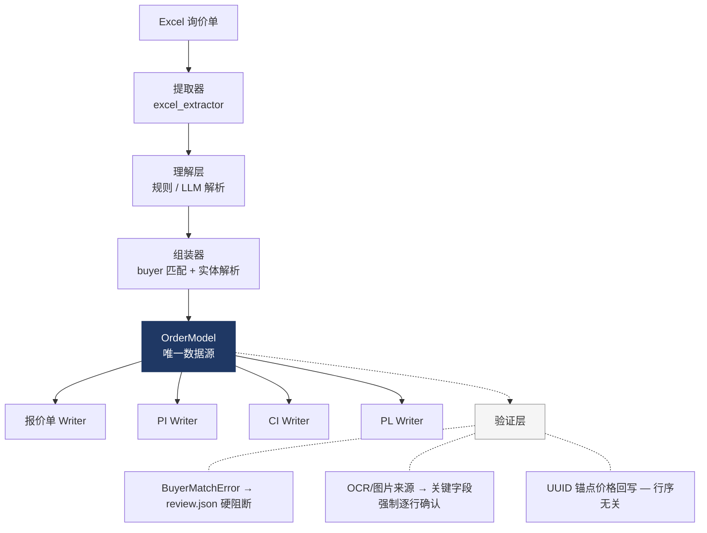

# Trade Pipeline — 技术深度版

> 这是技术深度版，给开发者和技术评估者看。业务向介绍见 [中文 README](README.md) · [English](README_EN.md) · [Русский](README_RU.md)

[中文](README.md) | [English](README_EN.md) | [Русский](README_RU.md)

---

## 架构



### 8 步管线

| 步骤 | 模块 | 功能 |
|------|------|------|
| 1 | `extractors/excel_extractor.py` | 自动识别 Excel 格式，选最佳 Sheet，提取数据 |
| 2 | `understanding/llm_parser.py` | 解析为结构化数据（规则模式或 Claude API + L1/L2 缓存） |
| 3 | `understanding/canonicalizer.py` | 标准化：DIN/ISO/GB 规范、中英翻译、分组 |
| 4 | `understanding/assembler.py` | Buyer 多级匹配 + OrderModel 组装 |
| 5 | `writers/quote_writer.py` | 报价单 + 隐藏 UUID 列 |
| 6 | `writers/pi_writer.py` | 形式发票 |
| 7 | `writers/ci_writer.py` | 商业发票 + SAY 大写金额 |
| 8 | `writers/pl_writer.py` | 装箱单（Lite 内置 / Full 接私有引擎 `pl-gen`，通过 `legacy/pl_gen_bridge.py` 自动探测） |

---

## 关键设计决策

### 1. OrderModel 唯一数据源

所有 Writer 只从 `OrderModel` 读数据，不允许重新解析 Excel。改一处数据，四份单据联动，不存在数据分裂的可能。

### 2. UUID 锚点价格回写，而不是行号

报价单发给客户后，客户可能插入行、调整顺序、加分组标题。如果按行号回写价格，行号一变价格就全错位。

解决方式：报价单每行藏一个隐藏 UUID 列。价格回写时通过 UUID 精确定位每一行，不管用户怎么编辑 Excel。这个设计来自一次真实事故，细节见 [README.md「这个工具是怎么做出来的」](README.md#这个工具是怎么做出来的)。

### 3. 买家匹配失败 = 硬阻断，不猜测

四级模糊匹配（法定名 → 别名 → 子串 → 模糊）全部未命中时，管线停止并生成 `review.json`，等待人工确认后再继续。宁可停下来问人，也不猜一个客户塞进去——猜错意味着把 PI/CI 发给了错误的抬头。

### 4. OCR/图片来源的数据强制逐行确认

`validation/ocr_reviewer.py`：只要某个字段的 `source_method` 是 `ocr` 或 `image`，即使置信度显示 0.99，关键字段（品名、标准号、数量、单位、重量）也会强制生成人工确认项，不允许"高置信就跳过"。扫描件/图片询价单的识别错误往往是系统性的，不能只靠置信度分数过滤。

### 5. 双模式解析 + 两级缓存

规则优先（快、免费、确定性），LLM 兜底（`--use-llm`，调用 Claude API 处理格式不规则的询价单）。L1 文件哈希 + L2 内容哈希 + prompt 版本号做两级缓存，改了 prompt 自动失效，不用手动清缓存。

### 6. 三种计价模式，自动检测

| 格式 | 场景 | 检测方式 |
|------|------|----------|
| CNY/MPCS | 国内客户紧固件 | 从 Excel 列头自动识别 |
| USD/PC | 国际客户紧固件 | 同上 |
| USD/TON | 按重量计价的垫圈类产品 | 同上 |

### 7. 两阶段业务流程

`--quote-only` 先生成报价单（谈判用，价格列留空），客户确认价格后用 `--price-update` 回写价格并生成正式的 PI/CI/PL。避免谈判阶段反复重做整套单据。

---

## CLI 参考

Skill 在背后调用的就是这套命令行接口（`python -m trade_pipeline ...`）：

| 参数 | 作用 |
|------|------|
| `--input <path>` | 询价单 Excel 路径 |
| `--order <id>` | 订单号 |
| `--buyer <buyer_id>` | 指定买家 ID，跳过自动匹配 |
| `--output-dir <path>` | 输出目录（默认 `output/<order>/`） |
| `--use-llm` | 用 Claude API 解析（替代规则模式），需要 `pip install -e ".[llm]"` |
| `--quote-only` | 只生成报价单，不生成 PI/CI/PL |
| `--price-update <quotation.xlsx>` | 回写填好单价的报价单，需配合 `--model` |
| `--model <model.json>` | 配合 `--price-update` 使用的 OrderModel 路径 |
| `--confirm <review.json>` | buyer 匹配失败后，人工编辑确认，继续管线 |
| `--confirm-packing` | 装箱方案人工确认 |
| `--interactive` | 交互式逐步确认模式 |
| `--check-only` | 只跑校验，不生成文件 |
| `--skip-warnings` | 跳过非阻断性警告 |
| `--no-precheck` | 跳过预检查 |
| `--no-catalog-save` | 不把本次产品信息写入本地产品目录缓存 |

首次配置向导：

```bash
python -m trade_pipeline init
```

会交互式引导填写公司信息、贸易条件、币种、装运港、第一个客户，写入 `config/config.yaml`。Claude Code 环境下由 `trade-pipeline-init` Skill 触发同一段逻辑。

---

## 运行测试

推荐使用 Python 3.12；仓库包含 `.python-version`，pyenv / uv 用户会自动识别。

```bash
py -3.12 -m pip install -e ".[test]"
py -3.12 -m pytest tests -q
py -3.12 -m ruff check trade_pipeline tests
```

## 设计文档

- [Gate Pattern](docs/gate-pattern.md) — AI 操作的三级门控：哪些自动执行、哪些要问人、哪些绝不能做
- [Output Verification](docs/output-verification.md) — AI 生成的文档怎么验证：round-trip 校验、清单校验、跨单据比对
- [LLM Wiki Pattern](docs/llm-wiki-pattern.md) — 怎么用 AI 把零散的业务知识整理成可复用的知识库

## 行业适配指南

当前版本按五金/紧固件行业（计价以重量为主、规格遵循 DIN/ISO/GOST 标准件体系）优化。适配到其他行业主要改三处：

| 要改的地方 | 在哪 |
|---|---|
| 产品识别 / 中英翻译 | `understanding/canonicalizer.py` + 翻译表 |
| 计价模式（如果不是按重量） | `understanding/` 计价检测逻辑 |
| 单据模板（表头、字段、版式） | `writers/` 下的各个 Writer |

## 技术栈

- **Python 3.12**（`pyproject.toml` 要求 `>=3.11`）+ openpyxl + PyYAML
- **Claude API**（可选，`pip install -e ".[llm]"`，用于 `--use-llm` 解析模式）
- **Claude Code**（开发环境，通过 MCP 协议协作构建）

## 许可证

MIT
